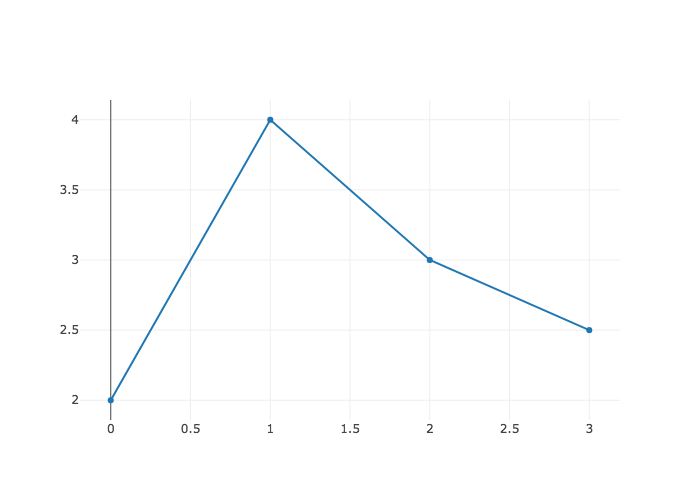
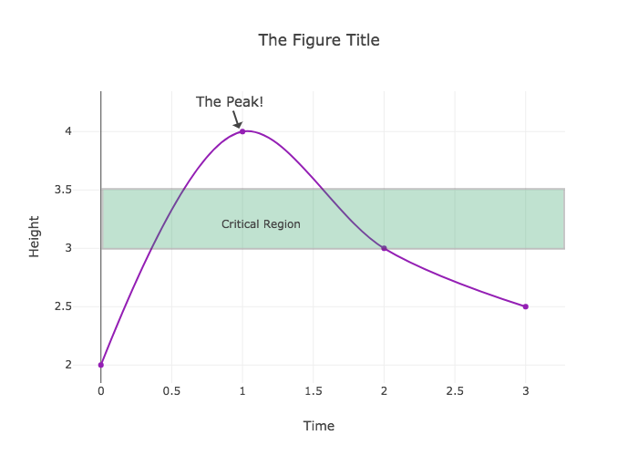

# jupyterlab-chart-editor

[](https://mybinder.org/v2/gh/plotly/jupyterlab-chart-editor/master?urlpath=lab/tree/notebooks)

A JupyterLab extension for creating and editing Plotly charts, based on https://github.com/plotly/react-chart-editor


## Prerequisites

* JupyterLab >= 0.31.0
* plotly.py >= 2.0.0

## Install

```bash
jupyter labextension install jupyterlab-chart-editor
```

## Usage

Create and display a figure

```python
import plotly.graph_objs as go
import plotly.io as pio

fig = go.FigureWidget()
fig.add_scatter(y=[2, 4, 3, 2.5])
fig
```


Write figure to JSON

```python
pio.write_json(fig, 'scatter.plotly')
```

Right-click `scatter.plotly` from the file menu and open with "Plotly Editor". Make some changes to the figure, then use the file menu to save as `scatter-styled.plotly`.

Then import `scatter-styled.plotly` back into plotly.py

```python
fig_styled = pio.read_json('scatter-styled.plotly', output_type='FigureWidget')
fig_styled
```


## Development

```bash
# Clone the repo to your local environment
git clone https://github.com/plotly/jupyterlab-chart-editor.git
cd jupyterlab-chart-editor
# Install dependencies
yarn
# Build Typescript source
yarn build
# Link your development version of the extension with JupyterLab
jupyter labextension link .
# Rebuild Typescript source after making changes
yarn build
# Rebuild JupyterLab after making any changes
jupyter lab build
```

You can watch the jupyter-renderers directory and run JupyterLab in watch mode to watch for changes in the extension's source and automatically rebuild the extension and application.

```bash
# Run jupyterlab in watch mode in one terminal tab
jupyter lab --watch
# Watch the jupyter-renderers directory
yarn watch
```

## Uninstall

```bash
jupyter labextension uninstall jupyterlab-chart-editor
```
